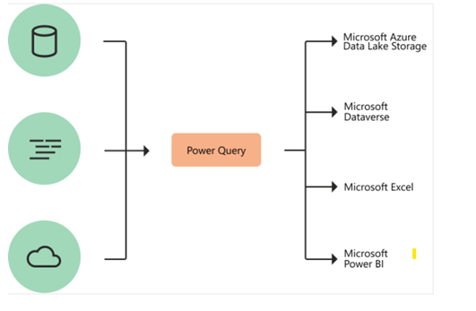

# PB

# What is Power Query?
 Power Query is a data transformation and data preparation engine. Power Query comes with a graphical interface for getting data from sources and a Power Query Editor for applying transformations.
Using Power Query, you can perform the extract, transform, and load (ETL) processing of data.

**How does Power Query help with data acquisition?**
 	Power Query enables connectivity to a wide range of data sources, including data of all sizes and shapes.
	Power Query Consistency of experience, and parity of query capabilities over all data sources.
	Highly interactive and intuitive experience for rapidly and iteratively building queries over any data source, of any size.
	When using Power Query to access and transform data, you define a repeatable process (query) that can be easily refreshed in the future to get up-to-date data.
	In the event that you need to modify the process or query to account for underlying data or schema changes, you can use the same interactive and intuitive experience you used when you initially defined the query.
	Power Query offers the ability to work against a subset of the entire dataset to define the required data transformations, allowing you to easily filter down and transform your data to a manageable size.
	Power Query queries can be refreshed manually or by taking advantage of scheduled refresh capabilities in specific products (such as Power BI) or even programmatically (by using the Excel object model).
	Because Power Query provides connectivity to hundreds of data sources and over 350 different types of data transformations for each of these sources, you can work with data from any source and in any shape.
