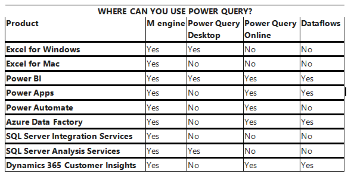
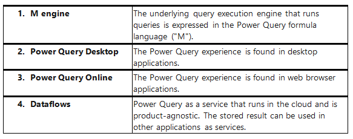
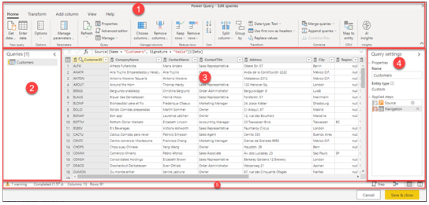
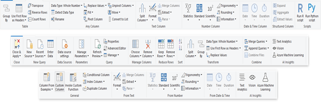

# PB

# What is Power Query?
 Power Query is a data transformation and data preparation engine. Power Query comes with a graphical interface for getting data from sources and a Power Query Editor for applying transformations.
Using Power Query, you can perform the extract, transform, and load (ETL) processing of data.


**How does Power Query help with data acquisition?**
-	Power Query enables connectivity to a wide range of data sources, including data of all sizes and shapes.
-	Power Query Consistency of experience, and parity of query capabilities over all data sources.
-	Highly interactive and intuitive experience for rapidly and iteratively building queries over any data source, of any size.
-	When using Power Query to access and transform data, you define a repeatable process (query) that can be easily refreshed in the future to get up-to-date data.
-	In the event that you need to modify the process or query to account for underlying data or schema changes, you can use the same interactive and intuitive experience you used when you initially defined the query.
-	Power Query offers the ability to work against a subset of the entire dataset to define the required data transformations, allowing you to easily filter down and transform your data to a manageable size.
-	Power Query queries can be refreshed manually or by taking advantage of scheduled refresh capabilities in specific products (such as Power BI) or even programmatically (by using the Excel object model).
-	Because Power Query provides connectivity to hundreds of data sources and over 350 different types of data transformations for each of these sources, you can work with data from any source and in any shape.

**Where can you use Power Query?**

The following table lists Microsoft products and services where Power Query can be found.




# 1.Power Query User Experience ?
The Power Query Editor is the primary data preparation experience, where you can connect to a wide range of data sources and apply hundreds of different data transformations by previewing data and selecting transformations from the UI. These data transformation capabilities are common across all data sources, whatever the underlying data source limitations.
When you create a new transformation step by interacting with the components of the Power Query interface, Power Query automatically creates the M code required to do the transformation so you don't need to write any code.

Currently, two Power Query experiences are available:
- **Power Query Online :** Found in integrations such as Power BI dataflows, Microsoft Power Platform dataflows, Azure Data Factory wrangling dataflows, and many more that provide the experience through an online webpage.
- **Power Query for Desktop :** Found in integrations such as Power Query for Excel and Power BI Desktop.

# 2.By default Power Quey Page looks like in the below,
The Power Query editor represents the Power Query user interface, where you can add or modify queries, manage queries by grouping or adding descriptions to query steps or visualize your queries and their structure with different views. The Power Query user interface has five distinct components.



1.	**Ribbon**: the ribbon navigation experience, which provides multiple tabs to add transforms, select options for your query, and access different ribbon buttons to complete various tasks.
2.	**Queries pane:** a view of all your available queries.
3.	**Current view:** your main working view, that by default, displays a preview of the data for your query. You can also enable the diagram view along with the data preview view. You can also switch between the schema view and the data preview view while maintaining the diagram view.
NOTE: The Schema view and Diagram View feature are available only for Power Query Online.
4.	**Query settings:** a view of the currently selected query with relevant information, such as query name, query steps, and various indicators.
5.	**Status bar:** a bar displaying relevant important information about your query, such as execution time, total columns and rows, and processing status. This bar also contains buttons to change your current view.

# 3. Transformations in Power Query:
These transformations can be as simple as removing a column or filtering rows, or as common as using the first row as a table header. There are also advanced transformation options such as merge, append, group by, pivot, and unpivot.
The following illustration shows a few of the transformations available in Power Query Editor.



# 4. Power Query M formula language
The M language is the data transformation language of Power Query. Anything that happens in the query is ultimately written in M. If you want to do advanced transformations using the Power Query engine, you can use the Advanced Editor to access the script of the query and modify it as you want. If you find that the user interface functions and transformations won't perform the exact changes you need, use the Advanced Editor and the M language to fine-tune your functions and transformations.


```t
let
    Source = Exchange.Contents("xyz@contoso.com"),
    Mail1 = Source{[Name="Mail"]}[Data],
    #"Expanded Sender" = Table.ExpandRecordColumn(Mail1, "Sender", {"Name"}, {"Name"}),
    #"Filtered Rows" = Table.SelectRows(#"Expanded Sender", each ([HasAttachments] = true)),
    #"Filtered Rows1" = Table.SelectRows(#"Filtered Rows", each ([Subject] = "sample files for email PQ test") and ([Folder Path] = "\Inbox\")),
    #"Removed Other Columns" = Table.SelectColumns(#"Filtered Rows1",{"Attachments"}),
    #"Expanded Attachments" = Table.ExpandTableColumn(#"Removed Other Columns", "Attachments", {"Name", "AttachmentContent"}, {"Name", "AttachmentContent"}),
    #"Filtered Hidden Files1" = Table.SelectRows(#"Expanded Attachments", each [Attributes]?[Hidden]? <> true),
    #"Invoke Custom Function1" = Table.AddColumn(#"Filtered Hidden Files1", "Transform File from Mail", each #"Transform File from Mail"([AttachmentContent])),
    #"Removed Other Columns1" = Table.SelectColumns(#"Invoke Custom Function1", {"Transform File from Mail"}),
    #"Expanded Table Column1" = Table.ExpandTableColumn(#"Removed Other Columns1", "Transform File from Mail", Table.ColumnNames(#"Transform File from Mail"(#"Sample File"))),
    #"Changed Type" = Table.TransformColumnTypes(#"Expanded Table Column1",{{"Column1", type text}, {"Column2", type text}, {"Column3", type text}, {"Column4", type text}, {"Column5", type text}, {"Column6", type text}, {"Column7", type text}, {"Column8", type text}, {"Column9", type text}, {"Column10", type text}})
in
    #"Changed Type"
```